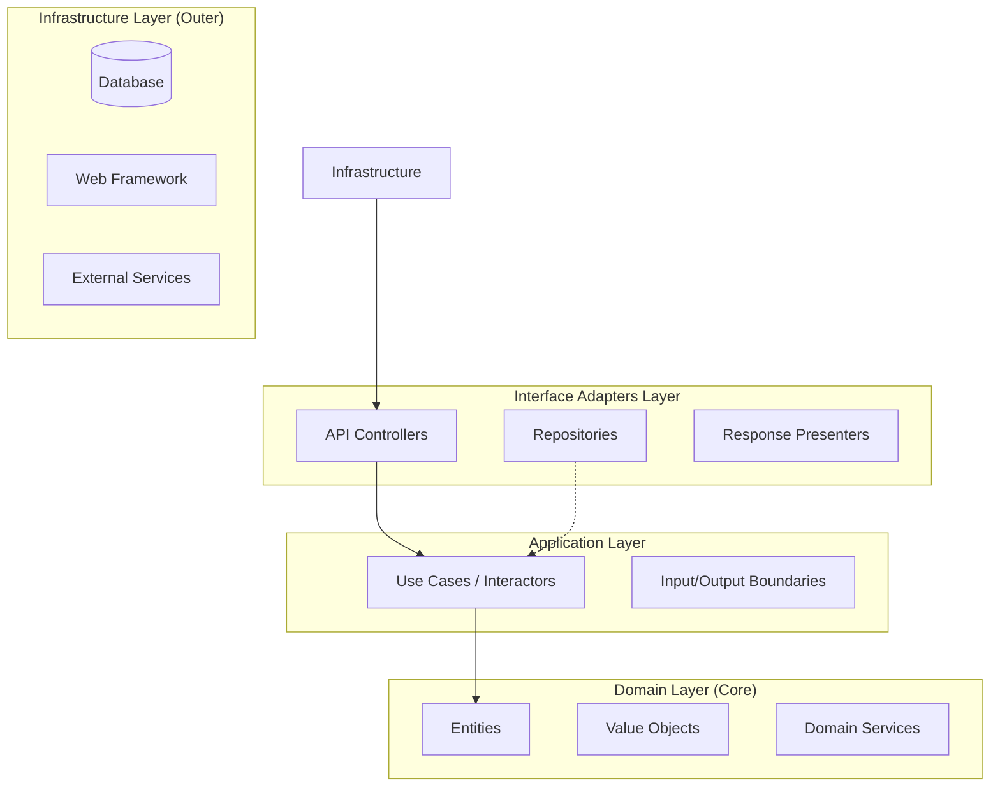

# User Management System: Clean Architecture Design

This document outlines the architectural blueprint for a User Management System designed using **Clean Architecture** principles. The architecture ensures that the core business logic remains independent of frameworks, UI, and external data sources.

## 1. High-Level Architecture Overview

The system is organized into concentric layers, where the inner layers contain policies and the outer layers contain mechanisms.

**Dependency Rule:** Dependencies only point inwards. The core (Domain) knows nothing about the outside world.

---

## 2. Domain Layer (Entities & Business Rules)

The Domain layer contains the most stable and high-level business rules.

### Key Entities
- **User**: A root aggregate representing a person in the system.
    - Attributes: Identity (UUID), Profile (Value Object), Account Status (Enum), Security Credentials (conceptual).
    - Invariants: 
        - A user must have a valid, unique email.
        - A deactivated user cannot perform certain actions.
        - Passwords must meet complexity requirements (logic defined here, not in the DB).

### Value Objects
- **EmailAddress**: Ensures format validity and provides equality checks.
- **Password**: Encapsulates hashing logic (or references a hashing strategy interface) and complexity rules.
- **Role/Permissions**: Represents authorization levels.
- **Bio/Profile**: Grouping of personal information (Name, Avatar, etc.).

### Domain Services
- **UserUniquenessService**: An interface/logic used when the uniqueness check involves more than just a single repository lookup (e.g., cross-referencing external registries).

---

## 3. Application Layer (Use Cases)

Contains application-specific business rules. It orbits the Domain layer.

### Primary Use Cases
- **CreateUser**: Orchestrates the creation of a new user, checking for existing users, and persisting via a repository.
- **UpdateUserProfile**: Manages changes to user metadata.
- **DeleteUser (Soft/Hard)**: Logic for removing or "archiving" a user.
- **Activate/DeactivateUser**: Updates the account status.
- **AuthenticateUser**: Coordinates credential verification.

### Boundaries (Interfaces)
- **Input Boundary**: Interface defining the request structure (e.g., `CreateUserInputPort`).
- **Output Boundary**: Interface defining the response structure (e.g., `CreateUserOutputPort`).

---

## 4. Interface Adapters Layer

Adapts data from the format most convenient for the use cases to the format most convenient for external agencies (like Web or DB).

### Components
- **Controllers**: Handle HTTP requests, parse parameters, and invoke the appropriate Use Case.
- **Presenters**: Transform the raw data from Use Case outputs into JSON, HTML, or other formats.
- **Repository Implementations (Inner Half)**: Interfaces that Use Cases depend on for data persistence.
- **DTOs (Data Transfer Objects)**: Simple objects for moving data across boundaries without exposing Entities.

---

## 5. Infrastructure Layer

The outermost layer where frameworks, tools, and drivers reside.

### Responsibilities
- **Database Logic**: Actual SQL/NoSQL implementation of the Repository interfaces.
- **Web Framework**: Express, NestJS, Spring Boot, etc.
- **External Services**: Email providers (SendGrid), Auth providers (Auth0/Firebase).
- **Configuration**: Dependency injection wiring and environment settings.

---

## 6. Detailed Controller-to-Use-Case Flow

The interaction between the Controller and the Use Case is governed by the Dependency Inversion Principle.

1.  **Request Handling**: The `UserController` receives an HTTP POST request to create a user.
2.  **DTO Factory**: The `UserController` uses a `RequestParser` to validate the incoming JSON and transform it into a `CreateUserRequestDTO`.
3.  **Boundary Interaction**: The `UserController` invokes the `execute` method on the `CreateUserUseCase` interface (the Input Boundary).
4.  **Business Logic**: The `CreateUserUseCase` implementation (the Interactor) performs the core logic:
    -   Instantiates a `User` entity from the DTO data.
    -   Invokes the `UserRepository` interface to check for existing users (uniqueness).
    -   Persists the new `User` entity via the `UserRepository.save()` method.
5.  **Presenting Output**: The Use Case produces a `CreateUserResponseDTO` and passes it to the `CreateUserOutputBoundary` (the Presenter interface).
6.  **Response Formatting**: The `WebUserPresenter` (Interface Adapter implementation) formats the response DTO into the final HTTP response (e.g., Status 201 Created with a specific JSON body).

---

## 7. Repository Abstraction Design

The repository is defined as an interface in the **Domain or Application layer** (depending on whether it purely handles entities or application state).

### Interface Structure: `IUserRepository`
- `findById(id: UUID): User`
- `findByEmail(email: EmailAddress): User`
- `save(user: User): void`
- `delete(id: UUID): void`
- `existsByEmail(email: EmailAddress): boolean`

**Note:** The implementation of this interface lives in the **Infrastructure layer**, allowing the database (e.g., PostgreSQL, MongoDB) to be swapped without affecting business logic.

---

## 8. Extension Points

The architecture is designed for growth and change:

-   **New Authentication Providers**: Add a new implementation of an `IAuthService` interface in the Infrastructure layer without touching Use Case logic.
-   **Email/Notification Systems**: Define an `INotificationService` interface in the Application layer. Implement it with SendGrid, SES, or a local log file in Infrastructure.
-   **Audit Logging**: Use a Decorator pattern around Use Cases or Repositories to intercept calls and log actions to an `IAuditRepository`.
-   **Soft Delete**: Implement `IDeletable` interface on entities and handle the logic within the `UserRepository` implementation to toggle a `deleted_at` field instead of removing rows.
-   **Authorization Policies**: Move complex permission logic into a `Policy` object within the Domain layer, allowing for dynamic RBAC or ABAC rules.

---

## 9. Testing Strategy

-   **Domain Layer (Entities & Value Objects)**:
    -   **Approach**: Pure unit tests with zero mocks.
    -   **Focus**: Business invariants, validation logic, and state transitions.
-   **Application Layer (Use Cases)**:
    -   **Approach**: Unit tests with mocks/stubs for Repositories and external service interfaces.
    -   **Focus**: Orchestration, transaction boundaries, and correct invocation of domain rules.
-   **Interface Adapters (Controllers/Mappers)**:
    -   **Approach**: Unit tests to verify that DTOs are correctly mapped to Entities and vice-versa.
-   **Infrastructure Layer**:
    -   **Approach**: Integration tests against a real (or containerized) database to verify SQL queries and data mapping.

---

## 10. Common Anti-Patterns to Avoid
-   **The "Anemic Domain Model"**: Entities being simple data bags with all logic residing in Use Cases. Business rules should stay in Entities where possible.
-   **Layer Skipping**: Controllers talking directly to Repositories, bypassing the Use Case layer.
-   **Heavy Entities**: Putting infrastructure concerns (like database-specific IDs or JSON tags) inside Domain Entities.
-   **Mocking Everything**: Over-mocking in unit tests to the point where the test only verifies the mock configuration rather than the behavior.
